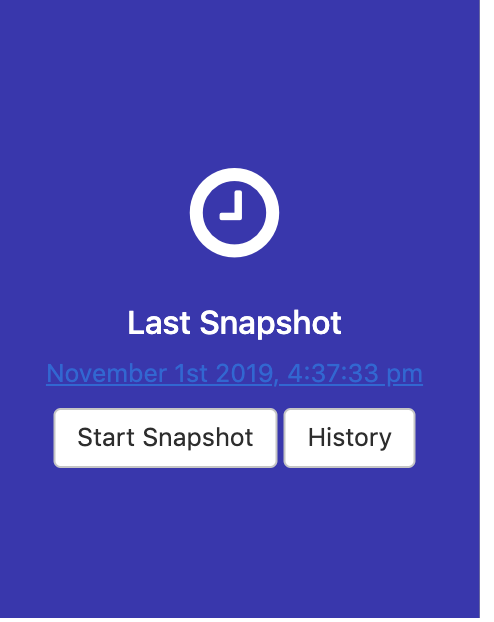

# ptfe-prodmount-vc-cloud-backuprestore
Install Prod Mount disk version with Valid Certificate - snapshot / backup / restore / use snapshot

Based on two repositories: https://github.com/Galser/ptfe-prodmount-vc-cloud and https://github.com/Galser/ptfe-demo-vagrant-vc-backuprestore

# Purpose

This repo contains all the code and instructions on how to install PTFE (Prod) version with a Valid Certificate in a cloud environment in mounted disk mode. With later making/restoration of its state from a snapshot. 

# Requirements

This repository assumes general knowledge about Terraform, if not, please get yourself accustomed first by going through [getting started guide for Terraform](https://learn.hashicorp.com/terraform?track=getting-started#getting-started). We also going to use AWS EC2 as our infrastructure provider, DNS service of CloudFlare and SSL Certificates from LetsEncrypt.

To learn more about the mentioned above tools and technologies -  please check section [Technologies near the end of the README](#technologies)


# How-to

## Prepare authentication credentials
- Beforehand, you will need to have SSH RSA key available at the default location :
  - `~/.ssh/id_rsa` and `~/.ssh/id_rsa.pub`
  > This key is going to be used later to connect to the instance where TFE will be running.
  
- Prepare AWS auth credentials (You can create security credentials on [this page](https://console.aws.amazon.com/iam/home?#security_credential).) To export them via env variables, execute in the command line :
    ```
    export AWS_ACCESS_KEY_ID="YOUR ACCESS KEY"
    export AWS_SECRET_ACCESS_KEY="YOUR SECRET KEY"
    ```
- Prepare CloudFlare authentication for your domain DNS management - register and export as env variables API keys and tokens. Follow instructions from CloudFlare here: https://support.cloudflare.com/hc/en-us/articles/200167836-Managing-API-Tokens-and-Keys
    - Export generated token and API keys :
    ```bash
    export CLOUDFLARE_API_KEY=YOUR_API_KEY_HERE
    export CLOUDFLARE_API_TOKEN=YOUR_TOKEN_HERE
    export CLOUDFLARE_ZONE_API_TOKEN=YOUR_TOKEN_HERE
    export CLOUDFLARE_DNS_API_TOKEN=YOUR_TOKEN_HERE
    ```

## Deploy infrastructure
- Clone this repo (*use the tools of your choice*)
- Open the folder with cloned repo
- Define your domain name in [variables.tf](variables.tf), edit on 2-nd line, following block : 
  ```terraform
  variable "site_domain" {
    default = "guselietov.com"
  }
  ```
- From inside folder with cloned repo init Terraform by executing : 
```
terraform init
```
Example output can be found here : [terraform_init.md](terraform_init.md)

- Now let's spin up everything, by executing :
```
terraform apply -auto-approve
```
Example output can be found here : [terraform_apply.md](terraform_apply.md)

Execution will take some time, and at the very end of the output you should see something similar to : 
```bash
Outputs:

backend_fqdn = ptfe-pm-2_backend.guselietov.com
cert_url = https://acme-v02.api.letsencrypt.org/acme/cert/03affc5ce49a164a80ca47ac6041c97240a2
full_site_name = ptfe-pm-2.guselietov.com
loadbalancer_fqdn = ag-clb-ptfe-pm-2-750426138.eu-central-1.elb.amazonaws.com
public_dns = ec2-52-59-210-55.eu-central-1.compute.amazonaws.com
public_ip = 52.59.210.55
```
- Please note that the successful `apply` should create 3 files with SSL certificate information in local folder : 
```bash
# ls -l site*
-rwxr-xr-x  1 andrii  staff  1935 Oct 31 15:17 site_ssl_cert.pem
-rwxr-xr-x  1 andrii  staff  3585 Oct 31 15:17 site_ssl_cert_bundle.pem
-rwxr-xr-x  1 andrii  staff  1679 Oct 31 15:13 site_ssl_private_key.pem
```
We are going to use them later. 


## Install TFE

## Terminal-based portion of TFE installation
- Connect to VM : 
```
ssh ubuntu@52.59.210.55
``` 
> Note : Use the `public_ip` or `backend_fqdn` from the previous step

- Start the PTFE install: 
```curl https://install.terraform.io/ptfe/stable | sudo bash```
    - use Public IP-address from previous steps ( `52.59.210.55` in the example ) for the service question. You can just press [Enter],
    - Reply `N` to proxy question. Again - you can just press [Enter]
    Output example : 
  ```bash
    % Total    % Received % Xferd  Average Speed   Time    Time     Time  Current
                                  Dload  Upload   Total   Spent    Left  Speed
  100  118k  100  118k    0     0  48967      0  0:00:02  0:00:02 --:--:-- 48967
  Determining local address
  The installer will use network interface 'ens5' (with IP address '172.31.2.88')
  Determining service address
  The installer will use service address '52.59.210.55' (discovered from EC2 metadata service)
  The installer has automatically detected the service IP address of this machine as 52.59.210.55.
  Do you want to:
  [0] default: use 52.59.210.55
  [1] enter new address
  Enter desired number (0-1): 0
  Does this machine require a proxy to access the Internet? (y/N) n
  Installing docker version 18.09.2 from https://get.replicated.com/docker-install.sh
  # Executing docker install script, commit: UNKNOWN 
  ...
  + sh -c apt-get update -qq >/dev/null
  + sh -c apt-get install -y -qq apt-transport-https ca-certificates curl >/dev/null...
  Operator installation successful

  To continue the installation, visit the following URL in your browser:

    http://52.59.210.55:8800

  ```

## Web-based portion of TFE installation

- Open your favorite browser and access the link that had been presented to you at the previous step: http:// 52.59.210.55:8800,  As we using self-signed certificates for this part of the installation, you will see a security warning when first connecting. **This is expected and you'll need to proceed with the connection anyway.**
- Now you will be presented with settings screen "HTTPS for Admin Console":


    Where you will need to
    - enter hostname: `ptfe-pm-2.guselietov.com` *( this used in the example, you may have another one if you modified settings earlier)*
    - Choose File for Private Key ( point to `site_ssl_private_key.pem` in the current folder)
    - Choose File for Certificate ( point to `site_ssl_cert.pem` in the current folder)
    - and press green button **[Upload & Continue]**

   > Sometimes, depending on the speed of instance connection and external resources replies you will fail to access this screen because load-balancer could not detect that Terraform Dashboard already running and removed it from service. Just wait 30 seconds and refresh the page.  
- Now you will need to present your license file. Usually, it comes in a special tar-ball package with extension RLI. Press **[Choose license]**, Locate the file and upload.


    > And you can also see - that you've been automatically redirected to the new URL: `https://ptfe-pm-2.guselietov.com:8800/`
    > and that the "lock" icon next to the FQDN of the site in the URL bar is closed, meaning that certificate recognized as valid by the browser and corresponds to the address of the site.
- The next screen allows you to select between *Online* and *air-gapped* installation. Choose **[Online]** :

And press **[Continue]** button
- On the next step, you will need to enter the password, that can be used in the future to access THIS, Admin Console :

Enter the desired password, and press continue
- Now you will see the "Preflight Checks" when all the main requirements for the PTFE installation checked and the one that passed marked with a green checkmark. They ALL should be green to pass.
Once more, press **[Continue]** button
- The next screen presents all your settings in one place
    - Check that host FQDN is correct
    - Scroll down to the *Installation Type* section and select **[Production]**
    - Now in the next section *Production Type* select **[Mounted Disk]**
    - Below it, in the *Mounted Disk Configuration* enter path : `/tfe-data`
    
    Consult the screenshot for guidance : 
    
    
    
    - Scroll to the next section: *SSL/TLS Configuration* - and paste the contents of your SSL Certificate bundle here
    ( Use the contents of the file `site_ssl_cert_bundle.pem` from current folder)
    After that - press **[Save]** button at the bottom of the page to save all your settings. And you going to be present with the following informational screen :

 Press **[Restart Now]**
- At this moment PTFE will do a full start of all internal services, it can take a couple of minutes, refresh the windows from time to time :

  > Note:..Depending on your browser and/or browser settings the starting in the left part of Dashboard - never changes unless you reload the page. So force-reload the page after 2-3 minutes.
- While TFE starting, please access top-right menu with settings, "Console Settings" item. In the opened page, find section *Snapshot & Restore*. In the filed **"Snapshot File Destination"** enter : `/tfe-snapshots`.
Press blue **[Save]** button at the bottom of the page.
- Return to the dashboard. Wait a couple of minutes for the state at the left rectangle to be changed to **Started**. Now, below the button [Stop now] there is link **[Open]** :

    

    Open it, this will lead you to the first-time setup of the admin user :
- Set up your admin user :

    
    
    Fill in the form and press **[Create an account]**
- Now you are logged-in, create organization and workspace in it, for the demo, we have organization *"acme"* and workspace *"playground"* : 
    
    
    
    > Names do not matter, but we are going to see that everything is restored from backup by checking that proper organization and workspace is in place, later.

Ok - you have new PTFE installation with organization and workspace -  installation is done. Now let's work with snapshots.


## Make snapshot
- Go to the *Admin Console* of PTFE: https://ptfe-pm-2.guselietov.com:8800/dashboard, at the right side of it you are going to see the section with the text *"Snapshots Enabled"* and a button **[Start Snapshot]**, press it  :

    

- After you have pressed the button, the right section is going to display progress through the series of status messages : 

    

- When the snapshot is done, the section is going to change, to indicate the date and time of the last snapshot, and bearing 2 buttons - **[Start Snapshot]** and **[History]** : 

    

## Kill TFE - Imitating full application disaster

In order to demonstrate recovery from a snapshot we are going to simulate full application disaster - wipe it out completely (preserving snapshot) and then restoring with the state.

- Login via SSH to your VM by executing : 
    ```
    ssh ubuntu@52.59.210.55
    ```
- Become root :
    ```
    sudo su -
    ```
- There is a special script that will imitate the crash and disaster, but still preserve our snapshots in [/tmp/delete_all.sh](delete_all.sh), 
execute it (**still under root privileges**):
    ```bash
    bash /tmp/delete_all.sh
    CONTAINER ID        IMAGE               COMMAND             CREATED             STATUS              PORTS               NAMES    
    ```
  Done, let's check, execute  : 
    ```
    ls -l /var/lib/replicated
    ls: cannot access '/var/lib/replicated': No such file or directory
    ```
  And the last check : 
- Let's check that we indeed "have killed" our application by accessing the Admin Dashboard at the URL : https://ptfe-pm-2.guselietov.com:8800/dashboarddashboard, and we see : 

    

### Restore from a snapshot

- If you are still in SSH session with your VM,reuse it, otherwise please connect once more by executing : 
    ```
    ssh ubuntu@52.59.210.55
    ```
- Start installation of PTFE again (remember? we had wiped out everything!) by executing : 
    ```bash
    curl https://install.terraform.io/ptfe/stable | sudo bash
    ```
- Repeat everything for the terminal portion of the install
    - select and re-use the same IP-address (as first time) `172.31.2.88` for 1-st question
    - confirm default address for the service IP (again, in our case  - same as first time) : `52.59.210.55` 
    - Select `no proxy` for Internet access
- Go the Web-portion of PTFE install, open in your browser : https://52.59.210.55:8800/
    - Press **[Continue to Setup]** and confirm security exception
    - at the screen *"HTTPS for admin console"* - supply proper SSL keys (**SAME as first time!**), certificate and bundle, use the name *"ptfe-pm-2.guselietov.com"* for the host (again - SAME name)
    - Press **[Upload & Continue]**
- Now, at the screen asking for the license, stop, there should be the link below : **[Restore from a snapshot]** : 
    
    

    Click it

- At the next screen you going to see: *Restore from a snapshot* with the message below -  *No snapshot found*

    You will need to enter the into field : "Snapshot File Path" following path (same as 1-st time) - `/tfe-snapshots` : 

    

    Press the button **[Browse snapshots]**, and you going to see after some time : 

    

- Choose the latest snapshot in the list and press the small button **[restore]** next to it, after that you will see a series of the screens with progress status  :

    

    And at the end - request to **unlock Admin Console**: 

    

- Unlock the console by entering the password from the very first installation and you will see again screen with *"Preflight Checks"*, press **[Continue]** button

-  Now you will see next screen - *Restore Cluster*, press the button **Restore** :

    

- After the process is finished, you going to see **"Cluster"** state page from where you can directly go to the *(Dashboard of Admin Console* and observe the progress in the left section : 

    

    and if you look at the greater picture : 

    

    > Note: You can spot that the right section right now have only **Snapshots Enabled** message, and nothing more.

    Wait until it finishes.

- Open *PTFE Dashboard* ( not Admin Console!), at workspaces for our [Looney Tunes-inspired organization](https://en.wikipedia.org/wiki/Acme_Corporation) : https://ptfe-pm-2.guselietov.com/app/acme/workspaces :

    

    As you can see from the screenshot - everything is in place.

This concludes the instruction section. now we have successfully performed the restore from a snapshot and resurrected our PTFE. Thank you.


# TODO


# DONE
- [x] define objectives 
- [x] create (reuse) code for infrastructure
- [x] install TFE in Prod mode
- [x] update README
- [x] make snapshot
- [x] kill TFE
- [x] restore TFE from snapshot
- [x] update README for restore part

# Run logs

- terraform apply  : [terraform_apply.md](terraform_apply.md)
- TFE destruction (full disaster imitation) : [tfe_destruction.md](tfe_destruction.md)
- terraform destroy of infra : [terraform_destroy.md](terraform_destroy.md)


# Technologies

1. **To download the content of this repository** you will need **git command-line tools**(recommended) or **Git UI Client**. To install official command-line Git tools please [find here instructions](https://git-scm.com/book/en/v2/Getting-Started-Installing-Git) for various operating systems. 

2. **For managing infrastructure** we using Terraform - open-source infrastructure as a code software tool created by HashiCorp. It enables users to define and provision a data center infrastructure using a high-level configuration language known as Hashicorp Configuration Language, or optionally JSON. More you encouraged to [learn here](https://www.terraform.io).
    - Specifically, we going to use Terraform for creating infrastructure, and install Terraform Enterprise. TFE Overview: can be found here: https://www.terraform.io/docs/enterprise/index.html
    - Pre-Install checklist: https://www.terraform.io/docs/enterprise/before-installing/index.html

3. **This project for virtualization** uses **AWS EC2** - Amazon Elastic Compute Cloud (Amazon EC2 for short) - a web service that provides secure, resizable compute capacity in the cloud. It is designed to make web-scale cloud computing easier for developers. You can read in details and create a free try-out account if you don't have one here :  [Amazon EC2 main page](https://aws.amazon.com/ec2/) 

4. **Cloudflare**, - is an American web infrastructure and website security company, providing content delivery network services, DDoS mitigation, Internet security, and distributed domain name server services. More information can be found here: https://www.cloudflare.com/ 

5. **Let'sEncrypt** - Let's Encrypt is a non-profit certificate authority run by Internet Security Research Group that provides X.509 certificates for Transport Layer Security encryption at no charge. The certificate is valid for 90 days, during which renewal can take place at any time. You can find out more on their [official page](https://letsencrypt.org/)


